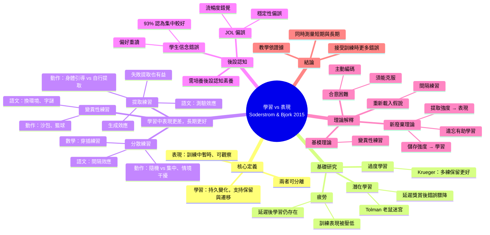

# Soderstrom & Bjork (2015)〈學習 vs. 表現：整合性回顧〉中文統整

*Perspectives on Psychological Science, 10(2), 176–199*

## 一、核心主張
- **學習 (learning)**：相對持久的行為或知識改變，能支持長期保留與遷移。
- **表現 (performance)**：訓練期間或剛結束時觀察到的暫時性變化。
- 兩者可以分離，有時甚至相反：
  - 有學習，但看不到表現進步（潛在學習、過度學習、疲勞）。
  - 表現進步，但沒有學習。
  - 讓訓練期間表現變差、錯誤變多的條件，常帶來最好的長期學習。

## 二、基礎研究：學習可發生在表現沒變時
| 現象 | 代表研究 | 發現 |
|---|---|---|
| 潛在學習 | Tolman & Honzik (1930) 老鼠迷宮 | 第 11 天才給食物，錯誤率立刻降到與一直有獎賞組相同，表示早已學會 |
| 過度學習 | Krueger (1929, 1930) | 達標後再多練 50%/100%/200%，長期保留更好 |
| 疲勞 | Adams & Reynolds (1954)、Stelmach (1969) | 疲勞壓低訓練表現，延遲後測驗顯示學習仍發生 |

## 三、表現好 ≠ 學得好：四大「合意困難」操作

### 1. 分散練習（間隔效應）
- 集中練習讓短期表現較好，分散練習讓長期保留較好。
- 動作技能：郵遞員學打字（分散組需更多天達標但保留更好）；Shea & Morgan (1979) 隨機練習訓練時較差，10 分鐘與 10 天後較好，且遷移更好（情境干擾效應）。
- 語文學習：法文單字 30 分鐘集中 vs. 連 3 天各 10 分鐘，立即測驗相同，7 天後分散組較好；也適用散文、邏輯、歸納推理與數學題穿插練習 (Rohrer & Taylor, 2007)。

### 2. 變異性練習
- 動作：Kerr & Booth (1978) 沙包練 2、4 英尺，在 3 英尺測驗反而較好；籃球罰球多距離練習延遲測驗較好。
- 語文：換房間學單字多回憶約 21%；統計課換地點；字謎多種排列。
- 解釋：讓學習者熟悉技能背後的一般性程式。

### 3. 提取練習（測驗效應）
- 動作：身體引導訓練時錯誤少、長期保留差 (Baker, 1968)；自行選擇與自行生成動作（預選效應）長期較好。
- 語文：重複學習 vs. 重複測驗，短期學習較好、延遲後測驗較好；散文實驗無回饋仍是測驗組 2 天與 1 週後較好；生成效應；失敗的提取或生成也能促進後續學習。

### 4. 小結
這些操作在訓練期間可能降低表現、增加錯誤，但長期學習更好。

## 四、後設認知：人們被「表現」騙了
- 學生信念錯誤：93.33% 認為集中學習較好；84% 偏好重讀，僅 11% 用提取練習。
- 回溯判斷錯誤：分散練習的郵遞員對訓練較不滿意；歸納學習中受試者親身體驗穿插有效後仍偏好集中。
- 學習判斷 (JOL) 錯誤：
  - 穩定性偏誤：以為現在的可提取性會維持，JOL 對保留間隔不敏感。
  - 受編碼流暢度與提取流暢度影響：容易、快的答案 JOL 高，實際反而記得較差。
  - 預測集中學習、重複閱讀較好，實際是分散學習、測驗較好。
- 結論：需培養後設認知素養，讓學習者選擇真正有效的策略。

## 五、理論解釋
1. **新廢棄理論** (Bjork & Bjork, 1992)：儲存強度（整合程度，決定學習，只增不減）與提取強度（取用容易度，決定表現，會流失）。提取強度越高，儲存強度增益越小；降低提取強度的操作帶來更多儲存強度增益，即「遺忘有助學習」。
2. **基模理論** (Schmidt, 1975)：變異性練習強化一般性動作程式。
3. **重新載入假說** (Lee & Magill)：間隔使運動程式暫時失去可及性，重新載入有助學習。
4. **合意困難** (Bjork, 1994)：增加訓練期困難可促進主動編碼；若學習者無法克服困難（如提取失敗且無回饋），則為不合意。與遷移適當處理、編碼特定性一致。

## 六、結論與建議
- 研究者：同時納入短期（表現）與長期（學習）測量，注意操作與保留間隔的交互作用。
- 教師與學生：區分學習與表現，採用間隔、變異、自我測驗，接受訓練時更多錯誤。教學應基於證據，而非歷史慣性或直覺。

## 心智圖

