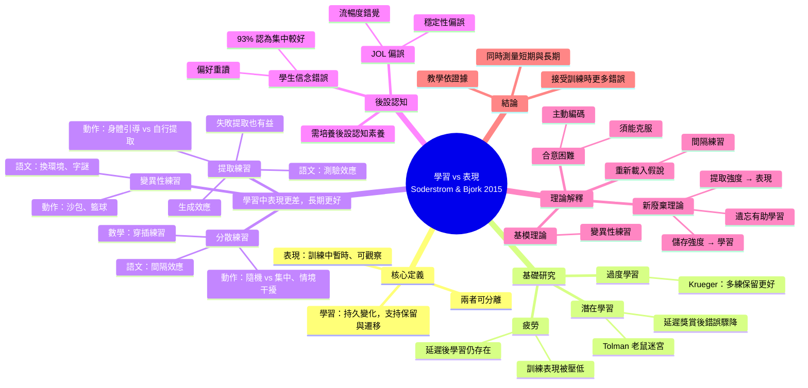

# Soderstrom & Bjork (2015)〈學習 vs. 表現：整合性回顧〉中文統整

*Perspectives on Psychological Science, 10(2), 176–199*

## 一、核心主張
- **學習 (learning)**：相對持久的行為或知識改變，能支持長期保留與遷移。
- **表現 (performance)**：訓練期間或剛結束時觀察到的暫時性變化。
- 兩者可以分離，有時甚至相反：
  - 有學習，但看不到表現進步（潛在學習、過度學習、疲勞）。
  - 表現進步，但沒有學習。
  - 讓訓練期間表現變差、錯誤變多的條件，常帶來最好的長期學習。

## 二、基礎研究：學習可發生在表現沒變時
| 現象 | 代表研究 | 發現 |
|---|---|---|
| 潛在學習 | Tolman & Honzik (1930) 老鼠迷宮 | 第 11 天才給食物，錯誤率立刻降到與一直有獎賞組相同，表示早已學會 |
| 過度學習 | Krueger (1929, 1930) | 達標後再多練 50%/100%/200%，長期保留更好 |
| 疲勞 | Adams & Reynolds (1954)、Stelmach (1969) | 疲勞壓低訓練表現，延遲後測驗顯示學習仍發生 |

## 三、表現好 ≠ 學得好：四大「合意困難」操作

### 1. 分散練習（間隔效應）
- 集中練習讓短期表現較好，分散練習讓長期保留較好。
- 動作技能：郵遞員學打字（分散組需更多天達標但保留更好）；Shea & Morgan (1979) 隨機練習訓練時較差，10 分鐘與 10 天後較好，且遷移更好（情境干擾效應）。
- 語文學習：法文單字 30 分鐘集中 vs. 連 3 天各 10 分鐘，立即測驗相同，7 天後分散組較好；也適用散文、邏輯、歸納推理與數學題穿插練習 (Rohrer & Taylor, 2007)。

### 2. 變異性練習
- 動作：Kerr & Booth (1978) 沙包練 2、4 英尺，在 3 英尺測驗反而較好；籃球罰球多距離練習延遲測驗較好。
- 語文：換房間學單字多回憶約 21%；統計課換地點；字謎多種排列。
- 解釋：讓學習者熟悉技能背後的一般性程式。

### 3. 提取練習（測驗效應）
- 動作：身體引導訓練時錯誤少、長期保留差 (Baker, 1968)；自行選擇與自行生成動作（預選效應）長期較好。
- 語文：重複學習 vs. 重複測驗，短期學習較好、延遲後測驗較好；散文實驗無回饋仍是測驗組 2 天與 1 週後較好；生成效應；失敗的提取或生成也能促進後續學習。

### 4. 小結
這些操作在訓練期間可能降低表現、增加錯誤，但長期學習更好。

## 四、後設認知：人們被「表現」騙了
- 學生信念錯誤：93.33% 認為集中學習較好；84% 偏好重讀，僅 11% 用提取練習。
- 回溯判斷錯誤：分散練習的郵遞員對訓練較不滿意；歸納學習中受試者親身體驗穿插有效後仍偏好集中。
- 學習判斷 (JOL) 錯誤：
  - 穩定性偏誤：以為現在的可提取性會維持，JOL 對保留間隔不敏感。
  - 受編碼流暢度與提取流暢度影響：容易、快的答案 JOL 高，實際反而記得較差。
  - 預測集中學習、重複閱讀較好，實際是分散學習、測驗較好。
- 結論：需培養後設認知素養，讓學習者選擇真正有效的策略。

## 五、理論解釋
1. **新廢棄理論** (Bjork & Bjork, 1992)：儲存強度（整合程度，決定學習，只增不減）與提取強度（取用容易度，決定表現，會流失）。提取強度越高，儲存強度增益越小；降低提取強度的操作帶來更多儲存強度增益，即「遺忘有助學習」。
2. **基模理論** (Schmidt, 1975)：變異性練習強化一般性動作程式。
3. **重新載入假說** (Lee & Magill)：間隔使運動程式暫時失去可及性，重新載入有助學習。
4. **合意困難** (Bjork, 1994)：增加訓練期困難可促進主動編碼；若學習者無法克服困難（如提取失敗且無回饋），則為不合意。與遷移適當處理、編碼特定性一致。

## 六、結論與建議
- 研究者：同時納入短期（表現）與長期（學習）測量，注意操作與保留間隔的交互作用。
- 教師與學生：區分學習與表現，採用間隔、變異、自我測驗，接受訓練時更多錯誤。教學應基於證據，而非歷史慣性或直覺。

## 專有名詞解釋

### 基本概念
| 名詞 | 解釋 |
|---|---|
| 學習 (learning) | 相對持久的行為或知識改變，能在長時間後仍保留，也能用到新情境。 |
| 表現 (performance) | 訓練當下或剛結束時看到的成績，會隨疲勞、狀態而波動。 |
| 習得期 / 獲得期 (acquisition) | 學習新技能或資訊的訓練階段。 |
| 保留 (retention) | 隔一段時間後，仍記得或做得出來的程度，通常用延遲測驗衡量。 |
| 遷移 (transfer) | 把學到的東西用在新題目、新動作或新情境上。 |
| 動作學習 / 語文學習 | 前者學身體技能（打字、投籃），後者學語言文字資訊（單字、散文）。 |

### 基礎研究
| 名詞 | 解釋 |
|---|---|
| 潛在學習 (latent learning) | 沒有獎賞、行為也沒有明顯改變時，學習其實已悄悄發生，要等有誘因才表現出來。 |
| 認知地圖 (cognitive map) | 對空間環境形成的心理表徵，例如老鼠在腦中記住迷宮。 |
| 增強 / 強化 (reinforcement) | 行為後給予獎賞（如食物），提高該行為出現的機率。 |
| 過度學習 (overlearning) | 已經達標（如能完整背出）之後繼續練習；程度 = 達標後多練的次數 ÷ 達標前所需次數。 |
| 漸近線 (asymptote) | 表現進步到頂、不再提升的水準。 |
| 重學 (relearning) | 忘記後重新學習，所需時間越短代表原本學得越牢。 |

### 練習方式
| 名詞 | 解釋 |
|---|---|
| 集中練習 (massed practice) | 把同一件事連續做完，中間沒有間隔。 |
| 分散練習 (distributed practice) | 把練習分成多段，中間插入休息或其他活動。 |
| 間隔效應 (spacing effect) | 分散學習比集中學習更利於長期記憶的現象。 |
| 穿插 / 交錯練習 (interleaving) | 把不同類型的題目或技能混著練，而非一種練完再練下一種。 |
| 阻塞練習 (blocked practice) | 同一種題目或動作連續練完，再換下一種。 |
| 情境干擾 (contextual interference) | 練習中不同項目互相干擾，使訓練時表現變差，卻促進長期保留與遷移。 |
| 變異性練習 (variable practice) | 練習時刻意改變條件（距離、場地、題型），而非一直重複同一種。 |
| 提取練習 (retrieval practice) | 不看答案、自己從記憶中回想，例如考自己。 |
| 測驗效應 (testing effect) | 考試本身就是強力的學習事件，考過的內容比重讀的記得更久。 |
| 生成效應 (generation effect) | 自己想出答案（如 hot–???→cold）比直接閱讀（hot–cold）記得更牢。 |
| 預選效應 (preselection effect) | 動作由學習者自己選擇，比由別人指定的保留更好。 |
| 身體引導 (physical guidance) | 教練手把手帶著學員做動作；訓練時錯誤少，但常不利長期學習。 |
| 失敗提取 / 失敗生成 | 先猜、猜錯，之後再看到正確答案，反而學得更好。 |

### 後設認知
| 名詞 | 解釋 |
|---|---|
| 後設認知 (metacognition) | 對自己思考與學習的認知，包括知道記憶如何運作，以及監控、調整自己的學習。 |
| 學習判斷 (JOL, judgment of learning) | 學習時預測「之後能記住的機率」，通常以 0–100% 回報。 |
| 回溯判斷 (retrospective judgment) | 事後回頭評價某次學習經驗有多有效。 |
| 前瞻判斷 (prospective judgment) | 學習當下預測未來的記憶表現，JOL 屬於這類。 |
| 穩定性偏誤 (stability bias) | 誤以為現在記得的程度會一直維持，低估日後的遺忘。 |
| 能力錯覺 (illusion of competence) | 因為當下表現順暢，誤以為自己已經學會。 |
| 流暢度 (fluency) | 處理資訊的容易程度。編碼流暢度指學習時多容易，提取流暢度指回想時多容易。 |

### 理論
| 名詞 | 解釋 |
|---|---|
| 新廢棄理論 (new theory of disuse) | Bjork 夫婦的理論，用「儲存強度」與「提取強度」解釋學習與表現的分離。 |
| 儲存強度 (storage strength) | 記憶與既有知識整合的深度，累積後不會消失，代表真正的學習。 |
| 提取強度 (retrieval strength) | 當下取出記憶的容易度，會隨時間下降，代表表現。 |
| 合意困難 (desirable difficulties) | 訓練時增加的「適度困難」，雖拖慢表現，卻促進長期學習。學習者無法克服時就不合意。 |
| 動作基模 / 一般動作程式 (schema, general motor program) | 一類動作背後共通的規則與參數（力道、速度、時機）；基模理論認為變異性練習能強化它。 |
| 重新載入假說 (reloading hypothesis) | 練習之間的間隔使動作程式暫時失去可及性，下次得重新載入，這個過程有助於學習。 |
| 遷移適當處理 (transfer-appropriate processing) | 學習時的認知處理與測驗時的處理越相似，記憶越好。 |
| 編碼特定性原則 (encoding specificity) | 記憶提取時，線索與當初編碼時的條件越吻合，越容易想起來。 |
| 可得性 / 可及性 (availability / accessibility) | 前者指記憶是否存在，後者指此刻是否取得到，大致對應學習與表現。 |
| 習慣強度 / 反應強度 (habit strength / response strength) | Hull、Estes 等早期理論用語，分別對應學習與表現。 |

## 心智圖

